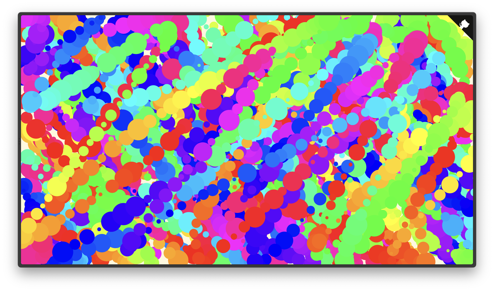
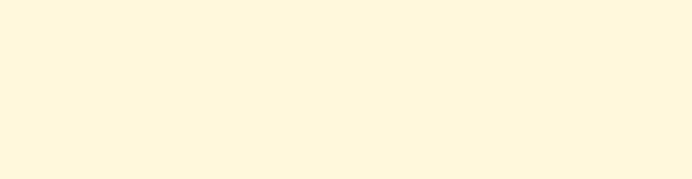

# ```🎨``` Splatter Paint


## 🍱 About:

[Splatter Paint](https://splatterpaint.vercel.app/) is a simple splatter painting website built with with an HTML canvas and Paper.js which allows to make colorful shapes in the browser: 

- Random circles of different colors and size when moving the mouse.
- Brush strokes of different colors and thickness when dragging it.

To do:
- [ ] Export the canvas as a ```svg``` file.

## 🖌 How does it look:





> ^ This is what the canvas looked like before drawing anything.

## 🔧 Contributing:

This project is **_not_ accepting major contributions** as it is personal.

## 📜 License:

Splatter Paint is made open-source with the [MIT License](https://github.com/javierzaleta/splatter-paint/blob/main/LICENSE).
