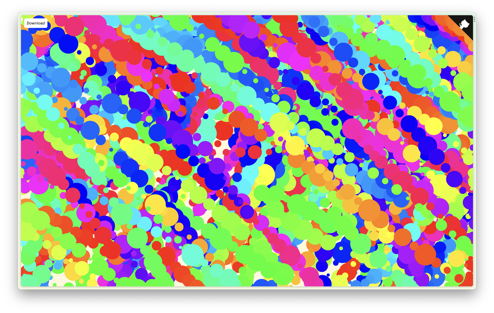

# ```🎨``` Splatter Paint


## About

[Splatter Paint](https://splatterpaint.vercel.app/) is a simple splatter painting website built using the HTML ```<canvas>``` element and the Paper.js library that allows you to make the following colorful shapes in the browser: 

- Random circles of different colors and sizes when moving the mouse.
- Brushstrokes of different colors and thicknesses when dragging the mouse.

After drawing something, you also have the option to export your canvas as an svg image if you want!




> ↑ This is what the canvas looked like before drawing anything.

## Motivations

I made this project as part of the Hack Club [Splatter Paint](https://workshops.hackclub.com/splatter_paint/) workshop to improve my coding skills, which I later enhanced with new features of my own.

<a href="https://hackclub.com/"></a>

## Contributing

This project is **_not_ accepting major contributions** as it is personal. However, if there is an issue — like a spelling or grammatical error, a visual bug, or other kinds of weird things happening — please feel free to [create an issue](https://github.com/j-cordz/splatter-paint/issues/new).

If you would like to leave comments about the source code — like possible design and code improvements, or other kinds of feedback — please feel free to [create an issue](https://github.com/j-cordz/splatter-paint/issues/new) too if you wish!

## License

This repository is made open-source with the [MIT License](LICENSE), meaning that you are allowed to modify and distribute the source code as well as use it for private and commercial use provided that the licence and copyright notices are retained. For more information, visit the link above to learn what is permitted by the licence.